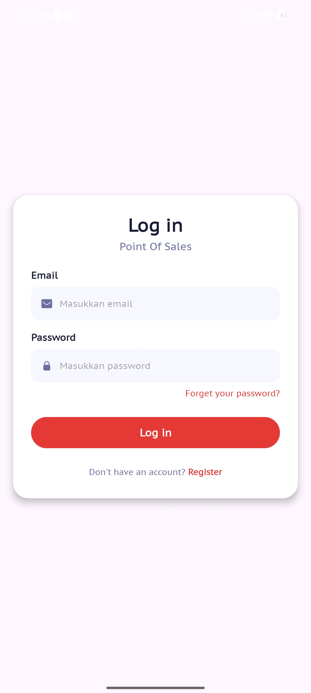
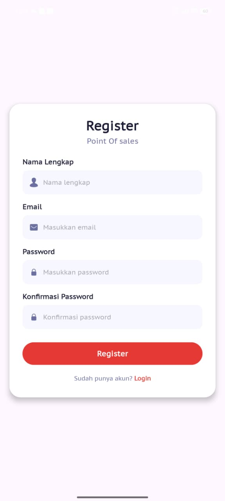
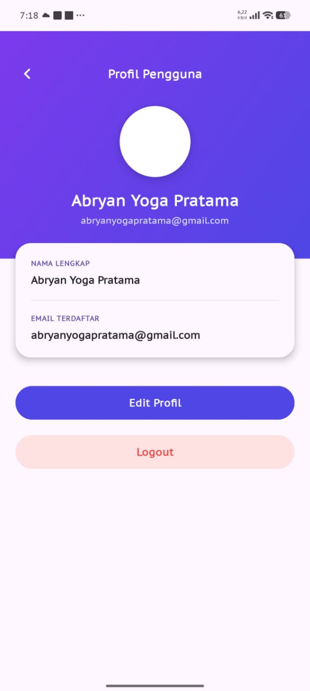
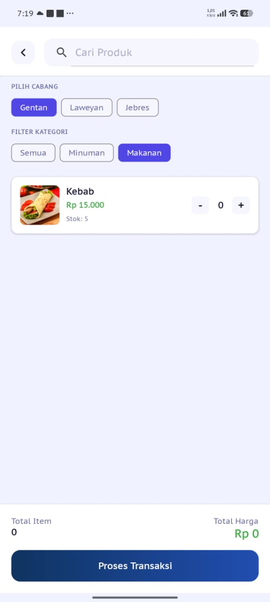
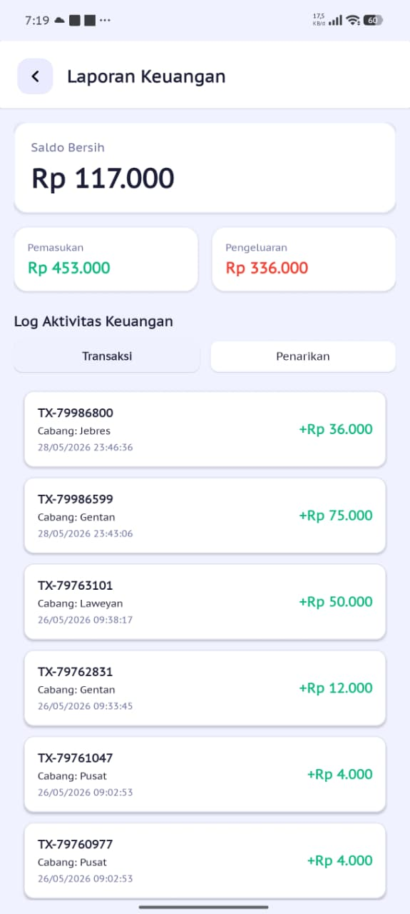

# Point of Sales (POS) Android Application

Aplikasi Point of Sales (POS) berbasis Android yang dibangun dengan Kotlin untuk memudahkan pengelolaan transaksi penjualan, inventori, dan laporan keuangan.

## 📱 Tentang Aplikasi

Aplikasi POS ini dirancang untuk membantu bisnis dalam mengelola operasional toko dengan fitur-fitur lengkap seperti manajemen produk, kategori, cabang, pegawai, transaksi, dan pelaporan. Aplikasi ini menggunakan Firebase sebagai backend untuk penyimpanan data real-time.

## ✨ Fitur Utama

- **Autentikasi Pengguna**
  - Login dan Register
  - Manajemen Profile
  - Edit Profile

- **Manajemen Data Master**
  - Data Cabang (Tambah, Edit, Hapus)
  - Data Kategori Produk
  - Data Produk dengan gambar
  - Data Pegawai

- **Transaksi**
  - Input transaksi penjualan
  - Pembayaran transaksi
  - Cetak nota transaksi
  - Riwayat transaksi

- **Laporan & Keuangan**
  - Laporan penjualan
  - Tarik tunai
  - Riwayat penarikan

## 🛠️ Teknologi yang Digunakan

- **Bahasa**: Kotlin
- **Min SDK**: 28 (Android 9.0)
- **Target SDK**: 36
- **Backend**: Firebase Realtime Database & Firebase Authentication
- **Image Loading**: Glide & Coil
- **Thermal Printer**: ESCPOS-ThermalPrinter-Android
- **Network**: OkHttp3

## 📋 Persyaratan

- Android Studio Arctic Fox atau lebih baru
- JDK 11
- Android SDK 28 atau lebih tinggi
- Koneksi internet untuk Firebase

## 🚀 Instalasi

1. Clone repository ini
```bash
git clone <repository-url>
```

2. Buka project di Android Studio

3. Tambahkan file `google-services.json` dari Firebase Console ke folder `app/`

4. Sync Gradle dan build project

5. Run aplikasi di emulator atau device fisik

## 📸 Screenshots

### Login & Register
<p align="center">
  
  
  
</p>

### Tampilan Utama
<p align="center">
  
</p>

### Manajemen Data Master

#### Data Cabang
<p align="center">
  
  
</p>

#### Data Kategori
<p align="center">
  
  
</p>

#### Data Produk
<p align="center">
  
  
</p>

#### Data Pegawai
<p align="center">
  
  
</p>

### Transaksi
<p align="center">
  
  
  
</p>

### Laporan & Riwayat
<p align="center">
  
  
  
</p>

## 📦 Dependencies

```kotlin
// Image Loading
implementation("com.github.bumptech.glide:glide:4.16.0")
implementation("io.coil-kt:coil:2.5.0")

// Firebase
implementation("com.google.firebase:firebase-database")
implementation("com.google.firebase:firebase-auth-ktx:23.2.1")

// Thermal Printer
implementation("com.github.DantSu:ESCPOS-ThermalPrinter-Android:3.3.0")

// Network
implementation("com.squareup.okhttp3:okhttp:4.12.0")
```

## 🏗️ Struktur Project

```
app/src/main/java/com/abryan/pointofsales/
├── Adapter/              # RecyclerView Adapters
├── Cabang/              # Manajemen Cabang
├── Kategori/            # Manajemen Kategori
├── Pegawai/             # Manajemen Pegawai
├── Produk/              # Manajemen Produk
├── Transaksi/           # Transaksi & Laporan
├── model/               # Data Models
├── MainActivity.kt      # Activity Utama
├── LoginProfile.kt      # Login
├── RegisterProfile.kt   # Register
└── Profile.kt          # Profile User
```

## 🔐 Permissions

Aplikasi ini memerlukan permission berikut:
- `INTERNET` - Untuk koneksi ke Firebase
- `BLUETOOTH` - Untuk koneksi printer thermal
- `BLUETOOTH_ADMIN` - Untuk manajemen Bluetooth
- `BLUETOOTH_CONNECT` - Untuk koneksi Bluetooth (Android 12+)
- `BLUETOOTH_SCAN` - Untuk scan Bluetooth (Android 12+)

## 👨‍💻 Developer

**Abryan**

## 📄 License

Copyright © 2024 Abryan. All rights reserved.

## 🤝 Kontribusi

Kontribusi, issues, dan feature requests sangat diterima!

## 📞 Support

Jika Anda memiliki pertanyaan atau memerlukan bantuan, silakan buat issue di repository ini.

---

**Note**: Pastikan untuk mengkonfigurasi Firebase dengan benar sebelum menjalankan aplikasi. File `google-services.json` diperlukan untuk koneksi ke Firebase.
